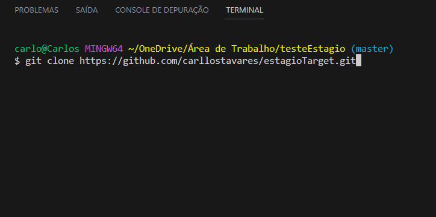

## 💻 Resolução das Atividades do processo seletivo da estágio Target  

## Como testar o código -  

Abra seu terminal dentro de uma pasta vazia e execute o seguinte comando:  git clone https://github.com/carllostavares/estagioTarget.git 

 Depois só executar o código desejado através do comando : node " nome do arquivo "

OBS: Será necessário instalar o Git e o Node.js para testa o código.
 

## Tecnologias usadas -  

